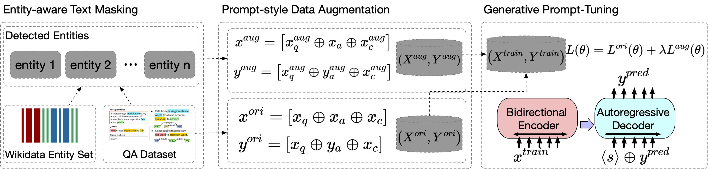

# Gotta: Generative Few-shot Question Answering by Prompt-based Cloze Data Augmentation (SDM'23)

This repository contains the source code and datasets for [Gotta: Generative Few-shot Question Answering by Prompt-based Cloze Data Augmentation](https://epubs.siam.org/doi/pdf/10.1137/1.9781611977653.ch102), SDM 2023.

## Links

- [Requirements](#requirements)
- [Overview](#overview)
- [Data](#data)
- [Train and Evaluation](#train-and-evaluation)
- [Citations](#citations)

## Requirements

The code is written in Python 3.8. Before running, you need to first install the required packages by typing following commands (Using a virtual environment is recommended):

```
pip install tokenizers==0.11.6 
pip install transformers==4.17.0
pip install rich[jupyter]
```

## Overview
**Gotta** is a data-driven constitution discovery and alignment framework for LLMs. Unlike existing alignment techniques, **IterAlign** has the following appealing features.
First, it does not require massive human preference data or human composed constitutions, but only takes a base LLM and a red teaming dataset as input.
The red teaming data is much cheaper to obtain compared to crowd-sourced human preference data.
Second, it does not require handwritten constitutions to be provided a priori.
Instead, it leverages the red teaming instances and a strong LLM to discover constitutions automatically, leading to a better aligned model and a set of valuable data-driven constitutions.

<p align="center">
  
</p>

## Data

### Downloading Few-Shot MRQA Splits

```bash
curl -L https://www.dropbox.com/sh/pfg8j6yfpjltwdx/AAC8Oky0w8ZS-S3S5zSSAuQma?dl=1 > mrqa-few-shot.zip
unzip mrqa-few-shot.zip -d mrqa-few-shot
```

## Train and Evaluation

```
python src/gotta/run.py --data_dir [YOUR_DATA_DIR] --dataset_name squad --gpu_id 0
```


## Citations

Please cite the following paper if you find this repo helpful for your research.
```
@inproceedings{chen2023gotta,
  title={Gotta: generative few-shot question answering by prompt-based cloze data augmentation},
  author={Chen, Xiusi and Zhang, Yu and Deng, Jinliang and Jiang, Jyun-Yu and Wang, Wei},
  booktitle={Proceedings of the 2023 SIAM International Conference on Data Mining (SDM)},
  pages={909--917},
  year={2023},
  organization={SIAM}
}
```
